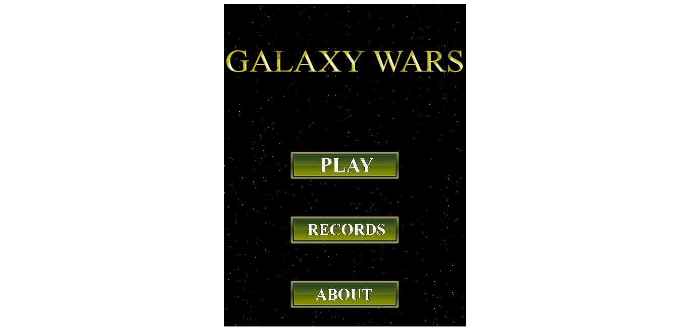

## JavaScript Capstone Project: Build a Shooter Game

In this project, I build a shooter game using JavaScript's framework [Phaser 3](https://phaser.io/), a "fast, free and fun open-source framework for Canvas and WebGL powered browser games".

## About

This project's objective was to build a shooter game similar to [York Computer's](https://learn.yorkcs.com/category/tutorials/gamedev/phaser-3/build-a-space-shooter-with-phaser-3/) tutorial. So I used the main idea but I created my own Battle for Space.

## Game

This is a simple endless runner. Enemies appear at the top of the canvas Some shoot you, some pass straight, some pursue you. You control your ship with keyboard **arrows** while you shoot with **space**. Just destroy as many enemies as you can before your you die.

In the end, you can add your name to our **Leaders Board** and check the high scores.**Leaders Board** only show top 5 scores if you beat all scores your score will be on top of other 4 scores.

## How to play

The commands were explained in the previous section  to move  to shoot.

You can play the game online clicking [here]() or locally following these steps:

- Click on the green button "Clone or Download"
- Click on Download ZIP
- Extract the game
- In your terminal, navigate to the game's folder
- Run `npm install` then `npm start` to start the sersver
- Open, in your browser, `localhost:8080`
- Beat my record and make my name disappear from the Leader Board

## Live Demo

- [live-version](https://weather-app-murod.netlify.app/)

## Built with

- JavaScript
- Phaser 3
- Webpack
- HTML
- CSS
- Eslint
- Babel
- Jest
- API

## Getting Started

- Clone the repo `git@github.com:Murodjon000/shooter-game.git`
- cd `into` the project
- Run `git pull origin app`
- Run `yarn install` or `npm install` to install dependencies
- On the terminal run `npm run start` open up the live server

## Author

👤 **Murodjon Tursunpulatov**

- Github: [@murodjon000](https://github.com/murodjon000)
- Twitter: [@MurodjonTursun5](https://twitter.com/MurodjonTursun5)
- Linkedin: [@Murodjon Tursunpulatov](https://www.linkedin.com/in/murodjon-tursunpulatov-5189481b3/)

## 🤝 Contributing

Contributions, issues and feature requests are welcome!

Feel free to check the [issues page](issues/).

## Show your support

Give a ⭐️ if you like this project!

## Acknowledgements

- [Microverse](https://www.microverse.org/)
- [OpenGameArt](https://opengameart.org/)
- [York Computer's](https://learn.yorkcs.com/category/tutorials/gamedev/phaser-3/build-a-space-shooter-with-phaser-3/)

## 📝 License

MIT License
