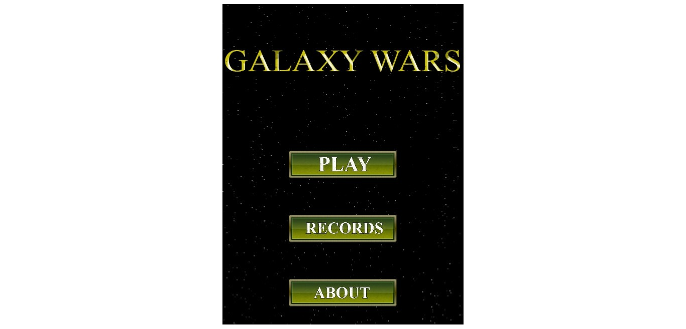

**🎮️ Name of the game: Shooter Game!\
👥 Stakeholders:**

- Dev: [Murodjon Tursunpulatov](https://github.com/murodjon000)
- Design: [Murodjon Tursunpulatov](https://github.com/murodjon000)
- QA: [Murodjon Tursunpulatov](https://github.com/murodjon000)

# Overview

## 📐 Project scope

- **Timeline: Needs to built within 5 working days from the request**
- **Budget: None**

## 🗣️ Elevator Pitch

This is a simple game. A player is expected to shoot other space ships to collect more scores.

## 💵 Monetization

I create this game only to learn how to build a web application with JavaScript and Phaser 3. Monetization is not under concern for now.

# Story

In Galaxy, there are a lot of space ships but not all of them are friends with each other. So there is one hero who should save his planet from enemies. To save his world he should shoot as many as enemies.

# Gameplay

In this game, you should shoot Carrier Ship, Gun Ship and Chaser Ship. But the scariest enemy is Chaser Ship because it chases you until you die. So you should be serious with Chaser ship. I think if you play the game you love it because it gives you the feeling of the past century.

# Core Game Mechanic

## #1 Build platform game with Phaser3 Library

In this project, the developer implements Phaser 3 Library to build the platform game

## #2 Apply actions like moving and shooting to the main character

The main character is able to move and shoot enemies.

## #3 Scoring system using API

Collect username and set it with their scores to the API.
Show the top 5 scorers' name and their scores in the score view.

# Game elements

## 👤 Characters

- A Space ship
- Carrier Ship, Gun Ship and Chaser Ship (enemies)

## 🏆️ missions & scores

- The mission is to shoot as many enemies as possible without
- If the main character shoots enemy, a player will get 10 points for an enemy
- In this score view, the top 5 scorers show

## 📦️ Objects

- Space Ships: Carrier Ship, Gun Ship and Chaser Ship
- Falling stars
- Black background to be like Galaxy

# Assets

## 🎨 Art

- Background images: some of them are used OpenGameArt materials

## 🔊 Sound

- Click sounds, back music: use OpenGameArt materials

## 🏃‍ Animation

- The main character: apply animations for its idle, move and shoot
